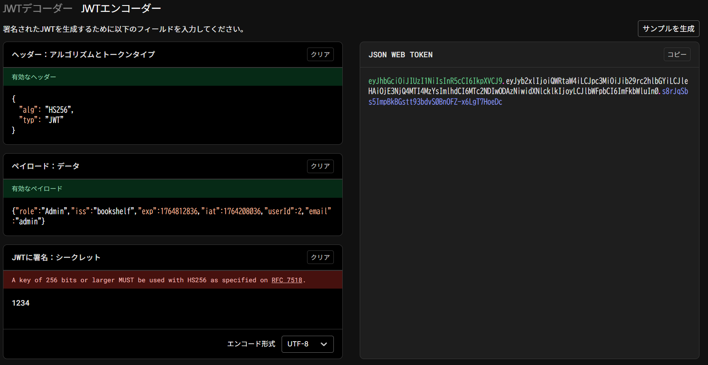
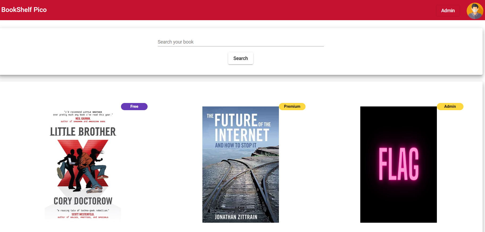
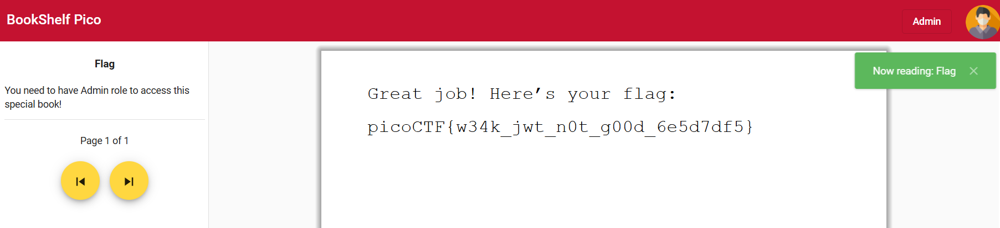

JWTを操作してAdmin権限を取得する

1. 問題で与えられているuser, userでlogin
1. JWTを確認
1. decodeしてpayloadをadmin用に修正

1. keyは1234(source code), user_idは2(guess)
1. 作成したJWTでブラウザリロード
1. Admin権限でログインできているのでFlag bookを開く

1. Flag

Best Youtube
https://www.youtube.com/watch?v=y6g7Q63LQPU